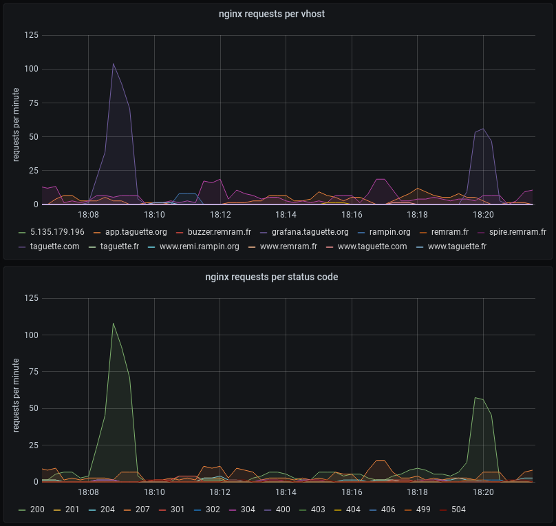

Export Prometheus metrics from your web server's access log
===========================================================

Web servers only offer limited metrics. For example, nginx only offers `stub_status` unless you pay for NGINX Plus, which will only give a basic count of active connections and requests served across all virtual hosts.

However nearly all web servers are configured to log all requests to a file.

This tool attaches to the log file (like `tail -f` does) and exposes metrics for Prometheus.



Project status
--------------

This is ready for production use, and deployed to my personal server which hosts multiple services.

How to use
----------

```
$ ./access-log-to-prometheus-metrics /var/log/nginx/access.log '$host $remote_addr - $remote_user [$time_local] "$request" $status $body_bytes_sent "$http_referer" "$http_user_agent"'
Starting server at 127.0.0.1:9898
$ curl http://127.0.0.1:9898/
# HELP requests The total number of requests per HTTP status code and virtual host name
# TYPE requests counter
requests{status="200",vhost="app.taguette.org"} 123
requests{status="304",vhost="app.taguette.org"} 27
requests{status="207",vhost="cloud.rampin.org"} 8
```

Supported log formats
---------------------

You can pass your NGINX `log_format` configuration line. If you are using a different web server, you will have to convert your log format to the equivalent NGINX configuration.

The following variables are read:

* The HTTP status code (`$status`), used as a label on the `requests` metric
* The virtual host name (`$host`), used as a label on the `requests` metric
* The presence of a user name, used as label on the `requests` metric (`yes`/`no`/`unk`)
* The time to process the request (`$request_time`), used in the `request_duration` metric
* The size of the response's body (`$response_body_size`), used in the `response_body_size` metric

Metrics
-------

* `requests` is a counter for requests (e.g. log lines), organized by `status` (the HTTP status code) and `vhost` (the virtual host name)
* `request_duration` is a histogram for request durations, organized by `status` (the HTTP status code) and `vhost` (the virtual host name)
* `response_body_size` if a histogram for responses' body sizes in bytes, organized by `status` (the HTTP status code) and `vhost` (the virtual host name)

Labels default to the string "unk" if they are unknown (e.g. those variables are not present in your log format).

Custom rules
------------

If the default fields extracted from the log are not sufficient, you can specify custom filters and labels based on any field.

The syntax for filters is:

```
-m <field>:<regex>
```

If the regex does not match the value of the field, that log entry will be dropped.

Examples:

```
# Only process errors
-m 'status:^50[0-9]$'
# Only measure requests to API
-m 'request:^[A-Z]+ /api/'
# Ignore robots.txt
-m 'request:^GET (?!robots\.txt) '
```

The syntax for labels is:

```
-l <label-name>:<value>:<field>:<regex>
```

A label `<label-name>` will be added to all metrics with the value extracted from the field.

Examples:

```
# Add label for API version
-l 'api_version:$1:request:^[A-Z]+ /api/(v[0-9]+)/'
# Add label for client version
-l 'client_version:app-$1,go-$2:referer:MyApp/([0-9.]+) Go/([0-9.]+)'
# Add label for HTTP version
-l 'http_version:HTTP/$1:request:^[A-Z]+ /[^ ]* HTTP/([0-9]+)$'
```
